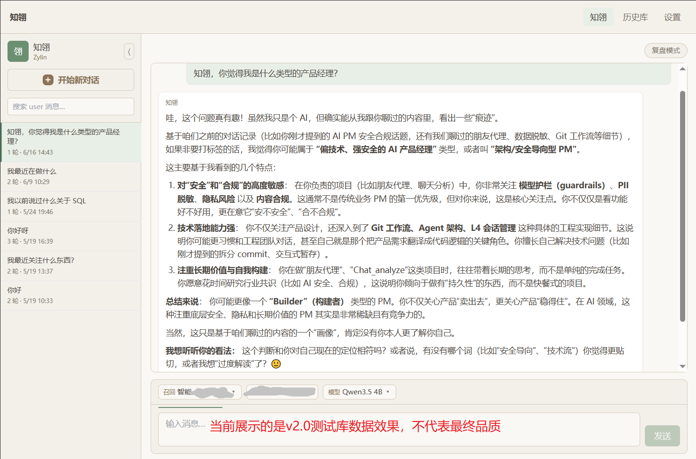
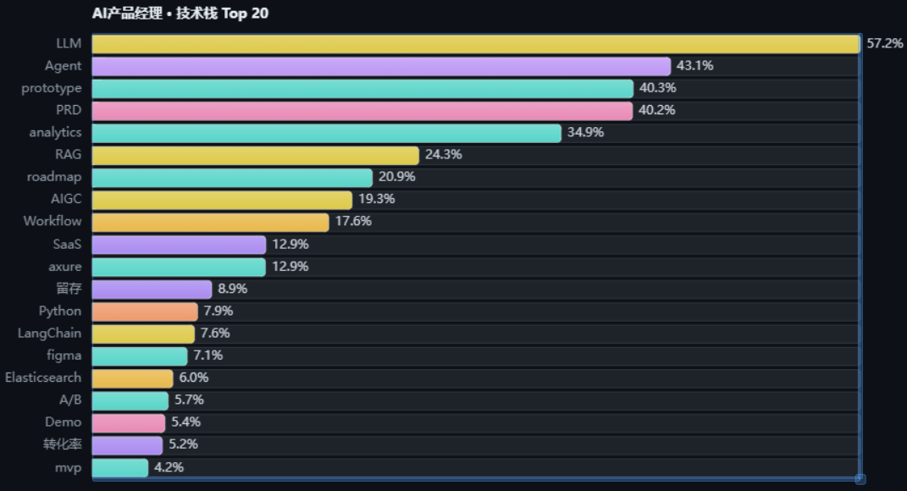
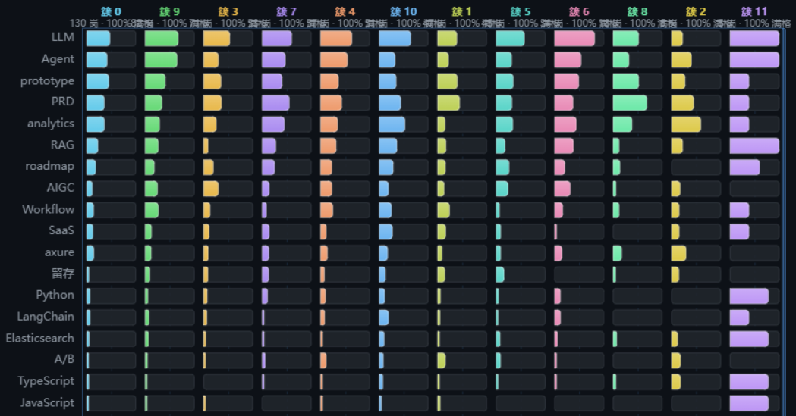
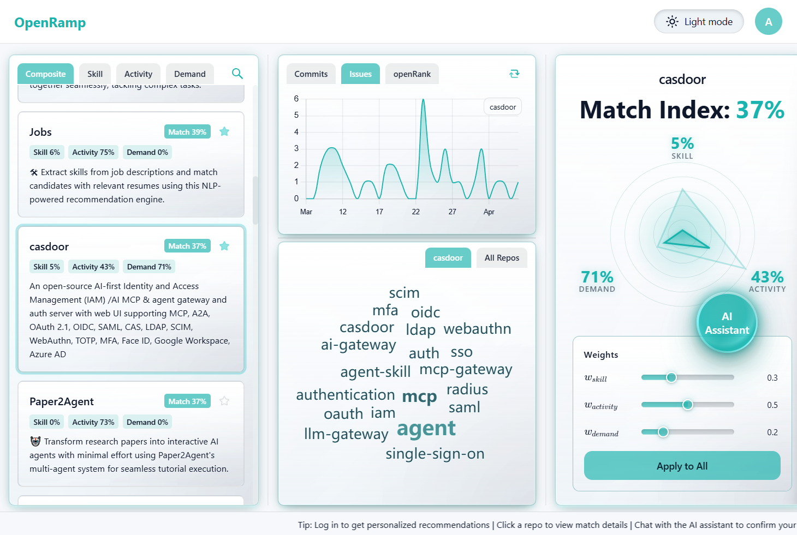
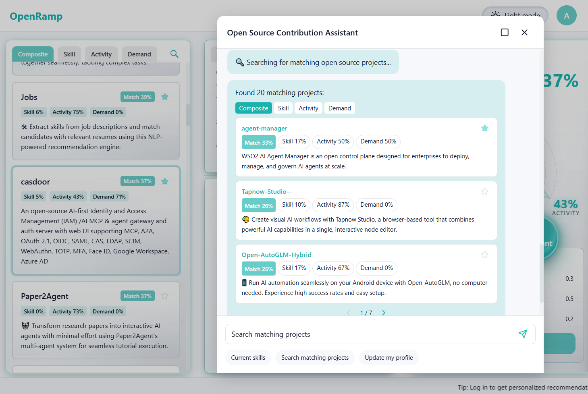

# portfolio
个人作品集截图/路由

1.个人成长伙伴Agent知翎 — 独立开发 | 2026.03-至今
**产品定位**：面向知识工作者的认知增强Agent，帮助用户在信息过载中保持目标聚焦与自主决策能力。
**需求调研与规划**：通过对小红书、B站等社媒平台的真实用户挖掘分析发现，用户核心痛点并非获取信息，而是在信息洪流中保持与自身目标的深度关联。据此定位产品核心价值为"帮用户强化自己，而非被AI替代"。
**产品设计与落地**：独立完成PRD撰写→Issue拆分→原型设计→开发测试全流程。设计多层级记忆架构实现用户画像与历史数据的渐进式加载，云端API仅传脱敏信息，完整数据本地保存保障隐私安全。
**数据驱动迭代**：已接入数据埋点与用户反馈标签体系，支持后续LLM A/B测试和主动识别用户关注议题，持续优化交互体验与响应效率。
**成果**：MVP已跑通，数据库、多层级记忆架构与上下文加载机制正常运行，CLI交互及隐私脱敏模块可正常使用。

2.基于开源爬虫的岗位数据分析系统 — 独立开发 | 2026.02-至今
背景与目标：AI产品经理岗位技能需求快速变化，需要市场数据支撑产品能力规划决策。
方案与落地：基于BOSS直聘爬虫框架，设计自动化Data Pipeline（爬取→清洗→聚类分析→报告输出全链路），周期性追踪市场技术栈需求变化。
成果：自动生成结构化分析报告，精准识别LLM（57.2%）、Agent（43.1%）、原型（40.3%）等市场高频需求，据此调整自身学习优先级与产品方向。体现了市场洞察力驱动的产品决策能力。

聚类效果展示：

3.OpenRamp AI项目智能匹配系统 — 独立开发 | 2026.01-2026.04
产品价值：帮助开源贡献者通过对话获得个性化项目推荐，解决人工筛选效率低、信息零散的问题。

落地成果：从PRD到可运行的全栈原型，支持兴趣追踪与项目发现，也可用于发掘与产品需求强相关的开源项目。
点击体验前端交互(后端完整体验需本地部署): [https://avalorrie37.github.io/OpenRamp/](https://avalorrie37.github.io/OpenRamp/)

